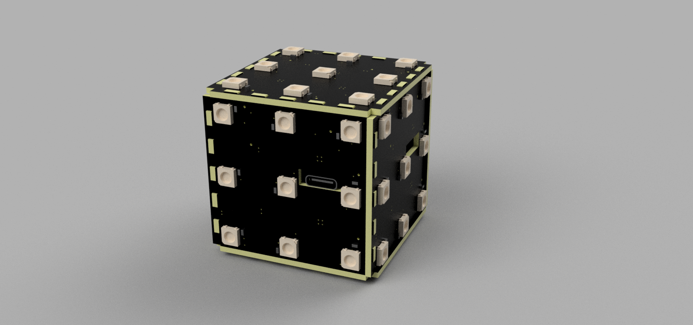

# A controllable 3x3 LED cube based on ESP32

## Introduction

[English](README.md) | [中文](README_cn.md)

This project is a 3x3 LED cube based on ESP32, which is a small toy that can achieve literal cube rotation through a gyroscope.

It has the following features:

- Full attitude solution, can realize arbitrary attitude operation
- Support type-c port charging and charging detection
- A power switch
- A user button, with multiple functions
- Low-power Bluetooth connection to mobile APP (under development)
- Programmable support for secondary development

Bilibili video link: https://www.bilibili.com/video/BV1AB4y1x72A

**Commercial use of this project requires my authorization**

## Mechanics

Without relying on external mechanical structures, it is connected by plug-in holes of PCB board, which is very sturdy.

It consists of three types of boards: 1 control board, 2 top light boards (B board) and 4 side light boards (A board).

## Hardware composition

- The main control is ESP32-S, with rich resources
- The lamp group is WS2812B, which can be controlled by three wires, very convenient
- The attitude sensor is MPU6050
- External USB type-c port, with serial port program download and charging function, support ESP32 one-key automatic download, secondary development is very convenient~~
- The charging scheme uses TP5400 as the charging and boosting integrated IC. The battery input is 3.7V and the charging current is 600mA.
- The battery I used was a 1200mAH rechargeable lithium battery from Shunxintong company on Taobao. This battery interface can be directly plugged into the battery port of the control board. It can be used for about four hours when fully charged.

## Firmware (platformio)

Based on Arduino framework, using C++ programming, compared to ESP-IDF can call many ready-made libraries, programming relatively simple

### Attitude solution

Use mpu6050 DMP quaternion to solve full attitude

Quaternion converted to left-multiply rotation matrix to calculate the center coordinates of each face in world coordinate system

### User button

- Short press: Switch operation face. Order: RUF -> MES -> LDB -> RUF
- Press twice in the middle: Random scramble
- Long press for 1 second: Reset pattern and recalibrate attitude sensor

### Passive buzzer

Compared with active buzzer, it can achieve multiple tones. You can even use it to play songs.

## Project directory

|   Name   |   Function   |
| :------: | :----------: |
|   doc    |   Document   |
| firmware |   Firmware   |
| hardware | PCB hardware |
|  image   |   Picture    |

## Precautions

1. Choose board thickness of 1.6 mm when making PCB samples
2. Use 3.7V lithium polymer battery
3. Control board and light board are connected by 1.25mm 4P cable (note that both ends are opposite in direction)
4. Short connect CHARGE and USB (3P pin header on board) when using control board normally
5. Charging voltage should be 5V 1A
