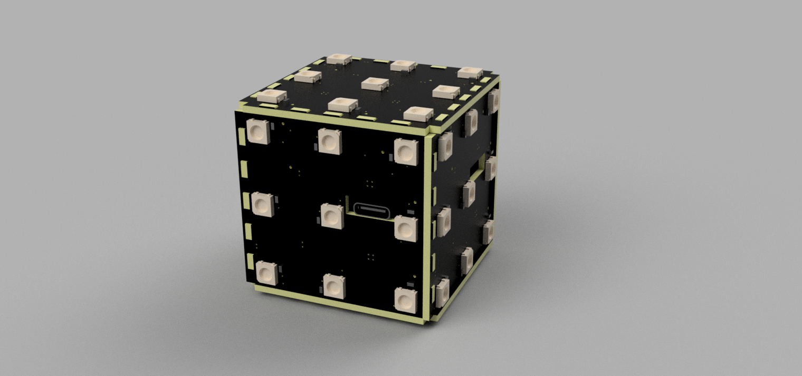

# 基于esp32的可操控三阶LED魔方

## 介绍

[English](README.md) | [中文](README_cn.md)

本项目为基于 ESP32 的三阶 LED 魔方，是可以通过陀螺仪实现字面意义上的魔方旋转的小玩具

具有如下特征：

- 全姿态解算，可实现任意姿态操作
- 支持 type-c 口充电及充电检测
- 一个电源开关
- 一个用户按键，具有多种功能
- 低功耗蓝牙连接手机APP（开发中）
- 可编程支持二次开发

B站视频链接：https://www.bilibili.com/video/BV1AB4y1x72A

**本项目商用需要获得本人授权**

## 机械

不借助外部的机械结构，全部由 PCB 板的孔洞栓插连接，十分结实

由三种板构成：1片控制板，2片顶灯板（B板）和4片侧灯板（A板）

## 硬件组成

- 主控为 ESP32-S，资源丰富
- 灯组为 WS2812B，三根线即可控制，十分方便
- 姿态传感器为 MPU6050
- 外部引出 USB type-c 口，具有串口程序下载和充电功能，支持 ESP32 的一键自动下载，二次开发十分方便~~
- 充电方案选用充电升压一体 IC TP5400，电池输入3.7V，充电电流600mA
- 电池我使用的是淘宝顺心通公司的 1200mAH 可充电锂电池，这个电池接口正好能直接插到控制板的电池口上，满电可以使用四个小时左右

## 固件（platformio）

基于 Arduino 框架，使用 C++ 编程，相比 ESP-IDF 可以调用很多现成的库，编程相对简单

### 姿态解算

使用 mpu6050 DMP 四元数解算全姿态

四元数转为左乘旋转矩阵计算世界坐标系下的每个面的中心坐标

### 用户按键

- 短按：切换操作面。顺序：RUF -> MES -> LDB -> RUF
- 中按两次：随机打乱
- 长按1秒：复位图案并重新校准姿态传感器

### 无源蜂鸣器

相比有源蜂鸣器可以实现多种音调，你甚至可以拿它放歌

## 项目目录

|   名称   |  作用   |
| :------: | :-----: |
|   doc    |  文档   |
| firmware |  固件   |
| hardware | PCB硬件 |
|  image   |  图片   |

## 注意事项

1. PCB 打样时选择板厚为 1.6 mm
2. 电池选用 3.7V 锂包电池
3. 控制板和灯板通过 1.25mm 4P 排线连接（注意买两头方向反的）
4. 控制板正常使用时短接 CHARGE 和 USB（板上的3P排针）
5. 充电电压最好为 5V 1A

